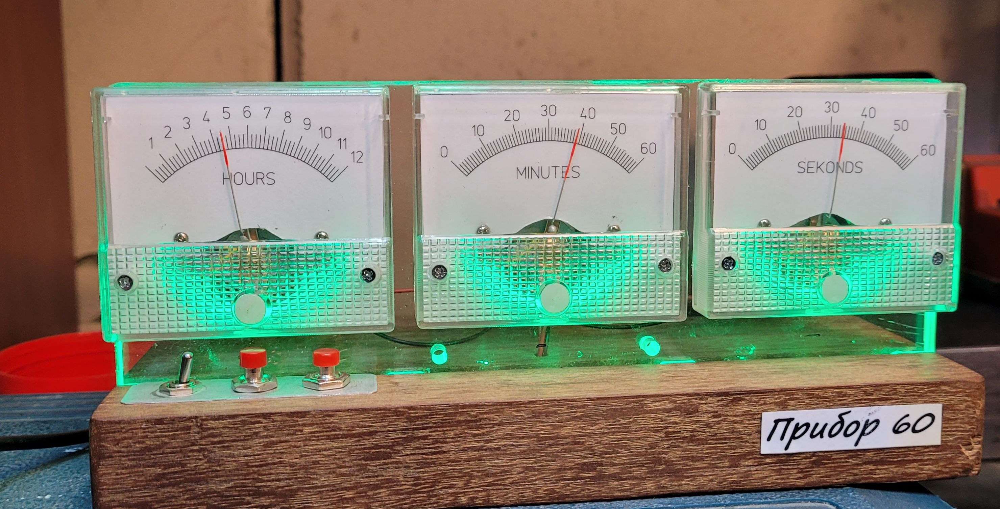
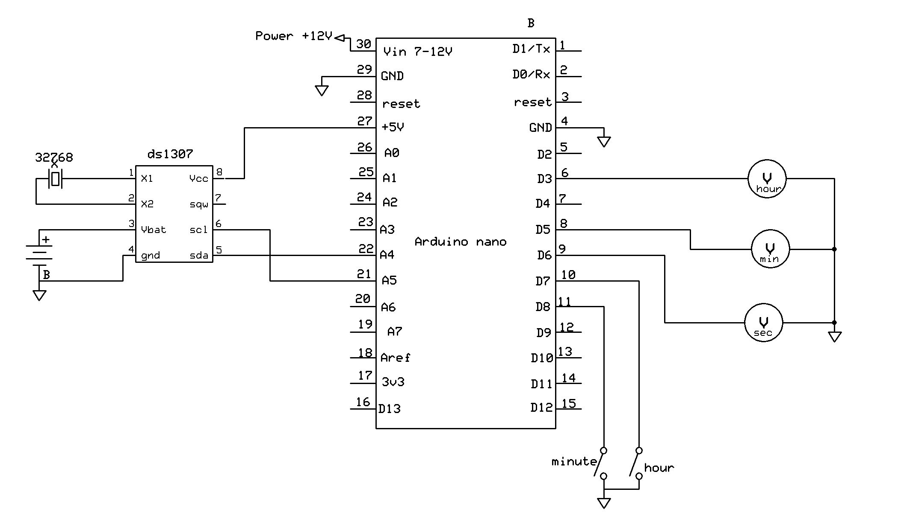

# Analog Volt Clock

This is copy of perfect projeсt https://github.com/MichMich/AnalogVoltMeterClock/tree/master

Just added quarter hour indication.

Many thanks to the author

## LICENSE
Permission is hereby granted, free of charge, to any person
obtaining a copy of this software and associated documentation files
(the "Software"). For more info see [LICENSE](https://github.com/MichMich/AnalogVoltMeterClock/blob/master/LICENSE).

## CONNECTIONS

### I used 5.00V Analog voltmeters.
In case you have full scale more then 5V, like 5,2-6 V buffers can used https://github.com/alexey1234/Arduinos/blob/main/AnalogVoltmeterClock/img/crazyclock_with%20buffers.jpg

